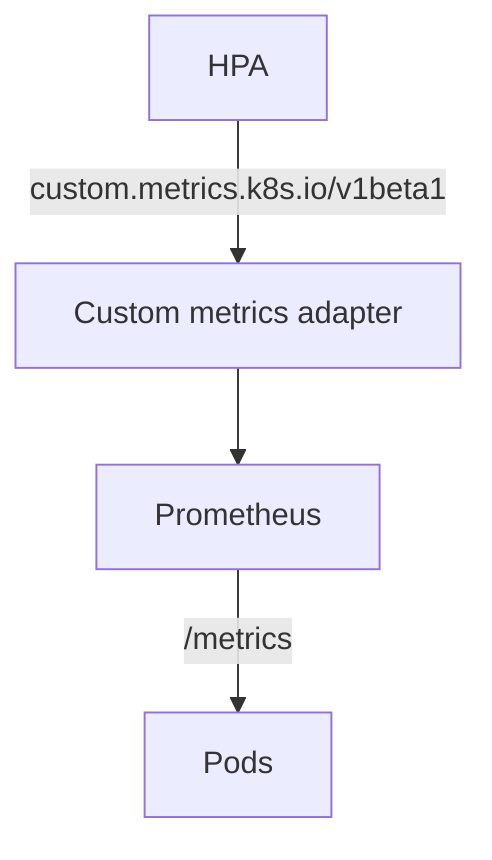

# Intro
Prometheus metrics can be used in order to horizontally autoscale the number of pods (HPA) of a
k8s cluster. A sample application exposing custom metrics in `/metrics` can scale in/out according
to the value of exposed metrics.
Both [prometheus](https://prometheus.io/), the HPA and its custom metrics adapter will be installed
in a separate namespace (_monitoring_) as shown in the following diagram:



# Install application

```bash
$ kubectl apply -f application.yaml
```

# Install prometheus

```bash
$ kubectl apply -f prometheus.yaml
```

# Install prometheus metrics adapter

```bash
$ helm repo add --force-update prometheus-community https://prometheus-community.github.io/helm-charts
$ helm install -n monitoring prometheus-adapter prometheus-community/prometheus-adapter -f prometheus-adapter.yaml
```

## Verify with:

```
$ kubectl get --raw /apis/custom.metrics.k8s.io/v1beta1 | jq
$ kubectl get --raw /apis/custom.metrics.k8s.io/v1beta1/namespaces/default/pods/*/open_sessions | jq
```

> May be required to generate some load as shown below before getting any response by the adapter

# Install HPA

```
$ kubectl apply -f hpa.yaml
```

# Generate some load to get some values for the metrics

```
$ export CLUSTER_IP=$(kubectl get service app-service --template='{{.spec.clusterIP}}')
$ echo "GET http://$CLUSTER_IP" | vegeta attack -rate 30 -duration 60s | vegeta report
```

# Check Prometheus UI

```
$ xdg-open http://$(kubectl -nmonitoring get svc/prometheus --template="{{.spec.clusterIP}}"):9090
```

Then navigate to `Status` > {`Service Discovery`, `Targets`}, prometheus should automatically discover
application's metrics and show the application (as well as prometheus itself) as target.
